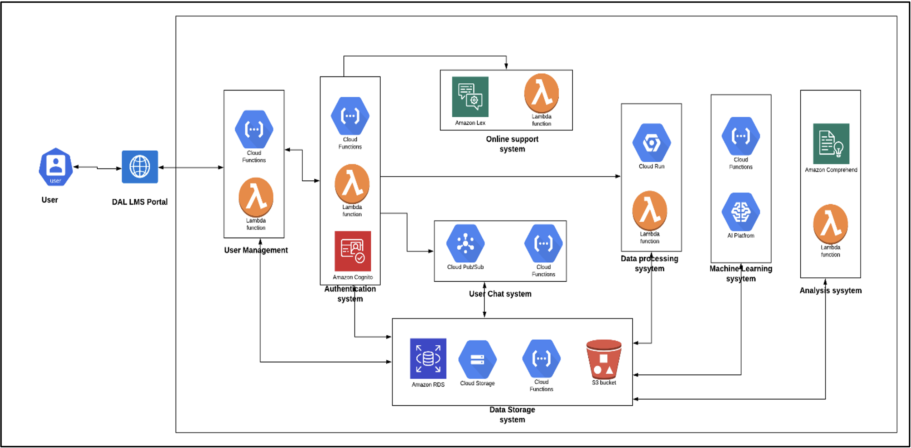

# Learning Management System - Built using multi-cloud serverless architecture model  

This repo has multiple microservices and all of them can be deployed separately. The following are the root directories based on the category.

1. [Backend](back-end)
2. [Frontend](front-end/csci-5410-t2-front-end)
3. [Serverless-functions](serverless_functions)

## LMS high-level system architecture

