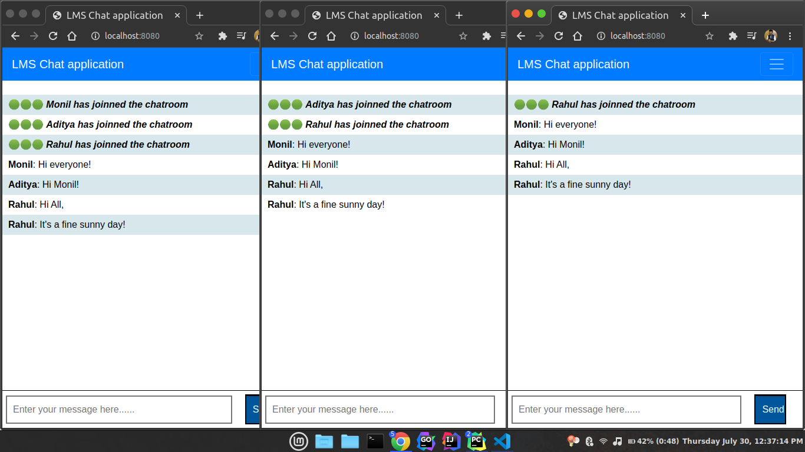
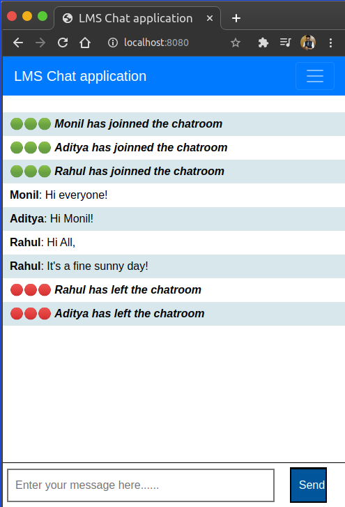
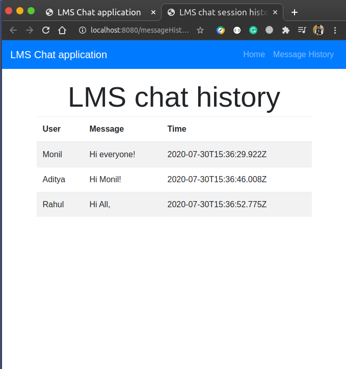

# LMS user chatroom application.

This is a NodeJs application built using Express and EJS for chatroom application using socket.io


## Installation

Import this project in any IDE.

Using [npm](https://www.npmjs.com/), install the depedencies by running following command:

```
npm install 
```

#### Adding environment variables
```
Add the 'GCP_PROJECT_ID' system variable with the GCP project id.
```

#### Running the project
```
npm start
```

## Usage

Open the service user in the brower. Each session is treated as a seperate socket connection for the chat. 


Enter the user name to chat. Until the browser/tab is closed, the socket connection will not be closed. 








#### View message history

Click on view view message history tab to retrieve the chat from GCP PubSub topic subscription


#### Workflow

1. With the first socket connect (userCount=1), a new topic and subscription gets created in the GCP PubSub. With each new user, the count is increased and with each disconnection, the count is decreased.

2. Each message sent using the socket is sent to the client first, and they are asynchornously pushed to GCP PubSub topic. These messages can be explicity retrieved by using the `message history tab`.

3. Once all the users are disconnected (userCount=0), the chat messages are retrieved from the topic created in the above step, a json file is created and the object is pushed to GCP storage bucket.


## Deploying the application in GCP CloudRun


Install and configure the [GCP SDK CLI](https://cloud.google.com/sdk) if not installed previously.

Modify the projectID and application name in the [cloudbuild.yaml](./cloudbuild.yaml) as per the requirement.

#### Add deployment permissions (Only if not done before)

1. Open the Cloud Build settings page in the Cloud Console:
(https://console.cloud.google.com/cloud-build/settings?_ga=2.259026890.1381264803.1595383748-320377619.1593537952)

2. In the Service account permissions panel, set the status of the Cloud Run Admin role to ENABLED:

#### Deploying the application using the automated script
Execute the following command to auto-deploy the application in CloudRun.
```
gcloud builds submit --config cloudbuild.yaml .
```


## Libraries used

1) [google-cloud-storage](https://pypi.org/project/google-cloud-storage/)
2) [google-pub-sub](https://www.npmjs.com/package/@google-cloud/pubsub)
3) [NodeJs](https://nodejs.org/en/)
4) [Express](https://expressjs.com/)
2) [socket.io](https://socket.io/)
